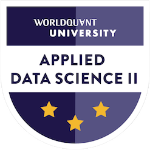

  

  
  

  

<h1 align="center">
  Hi Folks, Vando here!! 
  
</h1>

---
### :man_technologist: About Me:
Greetings!! I'm an AI enthusiast from Indonesa.
- :camera: I work as a Computer Vision Engineer, my main contribution is doing research in perception system for autonomous vehicle.
- :computer: I have experience in applying Object Detection, Tracking, and Segmentation both in 2D and 3D using several modalities (Camera and LiDar).
- :book: In my free time, I love to try working on online challenges, reading books, or doing some exercises.
- :page_with_curl: I also like to read the latest paper about Computer Vision and deep learning so I didn't get left behind in term of new tech.

---
### :hammer_and_wrench: Languages and Tools:

  
  
  
  
  
  
  
  
  
  
 

---
### :bowtie: License and Certification:

  <a href="https://www.credly.com/badges/f4728459-9a03-4532-b2b9-b34cca5147b7/public_url">
  
  <a href="https://www.credly.com/badges/f4f676af-e0ec-4d55-aac6-556b9449ca90/public_url">
  

